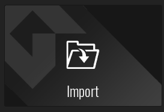

# GMS2-RPGTextEngine
 A customizable RPG text engine for GameMaker:Studio 2.

---

### Notice:
**I recommend you have a general understanding of how to use GameMaker:Studio 2 and GameMaker Language. It will make everything 100x easier.**

---
## How to import
First of all, you have to have a copy of GameMaker:Studio 2, duh. Download a release from the releases page. (I recommend the latest version.) Open up GameMaker, and click on Import.

*It looks like this.*

Locate to where you saved the download, and import the "RPGTextEngine.yyz" file.

Once it has imported, you're golden! You can press the play button or press F5 to start the project. You can change the font, sound effects, color, and alignment to your liking.

---

### Notice:
**You can only use MONOSPACE fonts (fonts where all of the letters are the same size) with this text engine. If you don't use a monospace font, the spacing might get wacky, but feel free to try and come up with a fix. It was just too difficult for me to get non-monospace fonts working.**

---

## How to use

You can use the **text_engine_print** script to print text. You can also apply different effects and set the position of your text.

*Example:*

text_engine_print("Hi, mom!",0,50,50);

---

*First argument: The string to print*

*Second argument: The style of the text*

*Third argument: X position*

*Fourth argument: Y position*

---

### Text styles

Right now there are only two styles: normal and shaky. I will add more in the future.

---

*0: Normal*

*1: Shaky*

---

### Line breaks

The character for line breaks is a backtick. (`) You can change it to whatever you want if you'd like, but it can only be one character. For instance,

text_engine_print("Hello.`New line!",0,50,50);

***would print as:***

Hello.

New line!

---

## Credits

Thanks for using my crap. I really appreciate it. :)

---

### Version: 0.1.0 (Alpha)

Because this is in alpha, it might have some annoying bugs. Please report them on the issues page. Thanks!

*- Chase Peck*